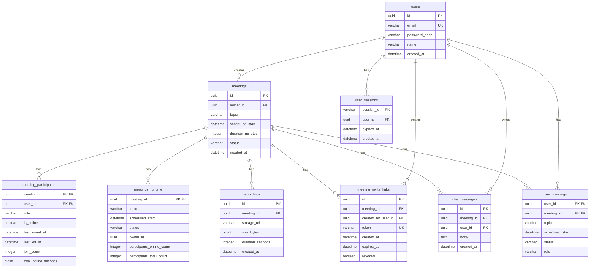
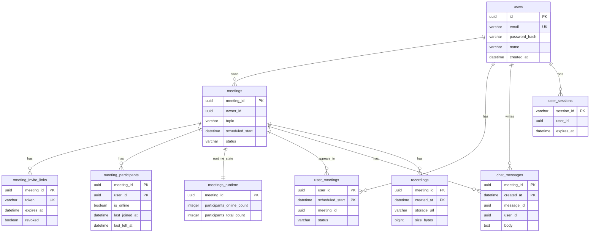
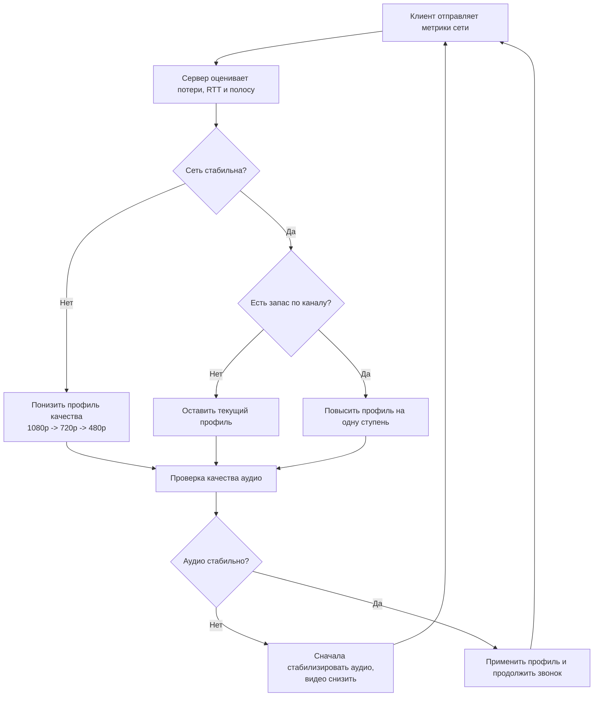
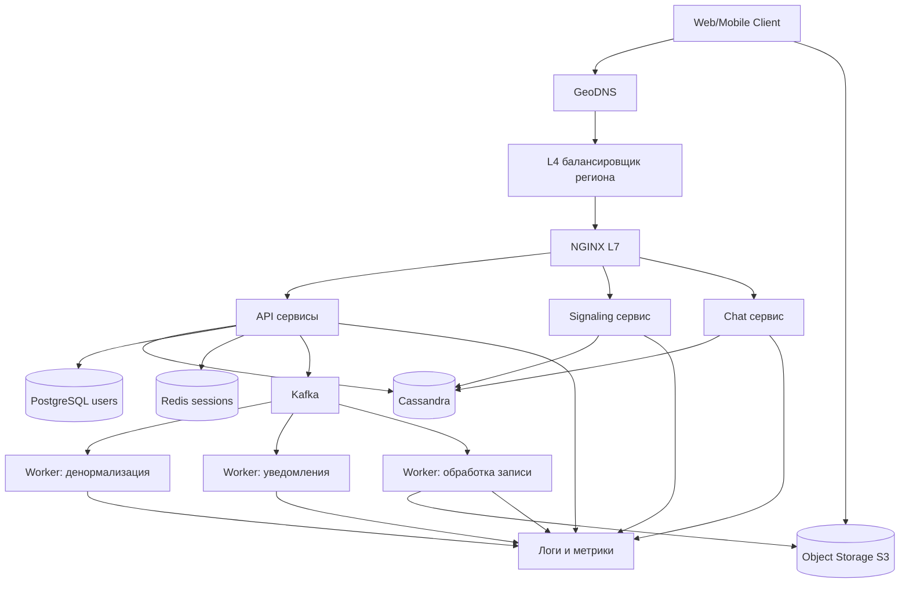

## **1. Тема и целевая аудитория**

### **Тип сервиса**
Сервис видеоконференций (платформа для онлайн-встреч, вебинаров и групповых звонков)

**Аналоги:** Microsoft Teams, Google Meet  
**Рыночная ниша:** Zoom занимает около 55-56% мирового рынка видеоконференций к 2025-2026 годам [Zoom Statistics 2026]

### Функционал MVP

1.  **Создание и участие во встречах**  
    Планирование и мгновенный старт встреч, публичные и приватные комнаты, приглашения по ссылке, пароли/логины на вход
2.  **Групповые видеозвонки**  
    Одновременное участие десятков пользователей
3.  **Демонстрация экрана**  
    Шеринг экрана, окна приложения или вкладки браузера
4.  **Чат во время встречи**  
    Общий чат, базовые реакции, отправка ссылок и коротких сообщений
5.  **Запись встреч**  
    Запись аудио/видео в «облако сервиса», последующее хранение и скачивание

### **Продуктовые решения**

*   **Реалтайм-видеосвязь с низкой задержкой**
*   **Поддержка групповых встреч и вебинаров**
*   **Разделение прав доступа** (организатор, участник, зритель)

### **Целевая аудитория**

| Параметр | Значение | Источник |
|----------|----------|----------|
| **Пиковое количество участников встреч в день** | 300,000,000 | [Reuters], [The Verge] |
| **MAU (оценка)** | 500,000,000 пользователей в месяц | [Zoom Statistics 2026] |
| **DAU (оценка уникальных пользователей)** | 300,000,000 пользователей в день | [Zoom Statistics 2026] |
| **География** | Глобальный рынок, доминирование в сегменте видеоконференций, >50% доли рынка | [Zoom Statistics 2026] |
| **Корпоративные клиенты** | сотни тысяч компаний, десятки тысяч клиентов с выручкой >100k$/год | [Zoom 10-K FY2025] |

## **2. Расчет нагрузки**

### **Продуктовые метрики**

| Метрика | Значение | Источник |
|---------|----------|----------|
| **MAU (оценка)** | 500 млн пользователей в месяц | [Zoom Statistics 2026] |
| **DAU (оценка)** | 300 млн пользователей в день | [Zoom Statistics 2026] |
| **Среднее количество встреч на пользователя в день** | 2 | Оценка |
| **Средняя длительность встречи** | 45 минут | Оценка (средняя длительность встреч) |
| **Средний размер встречи** | 10 участников | Оценка на основе распределения: часть встреч 1 на 1, часть - команды 5-20 человек |
| **Среднее количество записанных встреч на пользователя в день** | 0.2 (записывается 10% от 2 встреч в день) | Оценка |
| **Средний объем облачного хранилища записей на пользователя** | ~70 ГБ в месяц (0.2 записи в день * 30 дней * 350 МБ) | Оценка |
| **Среднее количество сообщений в чате на пользователя в день** | 20 | Оценка |

### **Технические метрики**

#### **Объем хранилища**

Допущения для оценки:

- DAU ≈ 300 млн, в среднем 2 встречи на пользователя в день  
- Средний размер встречи: 10 участников, около 60 млн встреч в день  
- Записывается 10% встреч, средний размер записи ~350 МБ (45 минут видео в среднем качестве)

| Тип данных | Кол-во объектов | Средний размер | Общий объем |
|-----------|-----------------|----------------|-------------|
| **Записи встреч (за сутки)** | 6,000,000 | 350 МБ | **2,100 ТБ/день** |

#### **Сетевой трафик**

По данным Zoom Technical Library, для групповой встречи в 720p требуется около 2.6 Мбит/с на отправку и 1.8 Мбит/с на приём трафика на одного участника [Zoom Bandwidth Requirements]
Для укрупнённого расчёта принимаем 2 Мбит/с на участника

На основе допущений выше оцениваем суммарный трафик:

| Тип трафика | Среднее значение (ГБ/день) | Пиковое значение (Гбит/с) |
|-------------|-----------------------------|----------------------------|
| **Видеозвонки (все участники)** | ~650,000,000 | ~60,000 |
| **ИТОГО исходящий трафик** | **~650,000,000 ГБ/день** | **~60,000 Гбит/с** |

#### **RPS (Requests Per Second)**

Оценка логических запросов на основе продуктовых метрик (300 млн DAU, в среднем 2 встречи и 20 сообщений в чатах на пользователя в день)

| Тип действия / запроса | Общее кол-во запросов в сутки | Средний RPS | Пиковый RPS (k=3) |
|------------------------|-------------------------------:|------------:|-------------------:|
| **POST /meetings/{id}/join** (подключение к встрече) | 300 млн * 2 = 600,000,000 | ~6,940 | ~20,800 |
| **SIGNAL /events** (сигналинг, управление сессией во время звонка) | оценочно 5 сигналинговых событий на минуту на участника, суммарно около 1,000,000,000 в сутки | ~11,600 | ~34,800 |
| **POST /chat/message** (сообщения в чатах встреч) | 300 млн * 20 = 6,000,000,000 | ~69,400 | ~208,000 |
| **ИТОГО** | **~7,600,000,000** | **~87,000 RPS** | **~263,000 RPS** |

Итого по расчетам: суммарный RPS складывается из 600 млн подключений к встречам, примерно 1 млрд сигналинговых событий и 6 млрд сообщений в чатах в сутки

## **3. Глобальная балансировка нагрузки**

### **3.1. Расположение датацентров и схема DNS балансировки**

Опираемся на глобальную аудиторию Zoom и требования к низкой задержке для видеосвязи

| Регион | Расположение ДЦ | Пользователи (MAU) | Доля | Маршрутизация GeoDNS | Резервный ДЦ |
|--------|-----------------|---------------------|------|---------------------|-------------|
| **Северная Америка** | Восточное побережье США | 225,000,000 | 45% | Северная и Южная Америка в этот ДЦ | Франкфурт |
| **Европа / Ближний Восток** | Франкфурт | 150,000,000 | 30% | Европа и Ближний Восток в этот ДЦ | Сингапур |
| **Азия / Океания / Африка** | Сингапур | 125,000,000 | 25% | Азия, Океания и Африка в этот ДЦ | Восточное побережье США |

Всего 3 региональных ДЦ, суммарно покрывающих 500 млн MAU, при этом на один ДЦ приходится не более ~225 млн MAU

**Принцип работы GeoDNS:**

GeoDNS (Geographic DNS) выдаёт разные IP адреса в зависимости от географии DNS резолвера, который выполняет запрос

1. Клиент отправляет DNS-запрос на `zoom.com` через локальный DNS резолвер
2. DNS резолвер спрашивает авторитетный DNS-сервер Zoom
3. Авторитетный DNS-сервер определяет географию резолвера по GeoIP-базе
4. В ответ возвращается IP ближайшего регионального ДЦ
5. DNS резолвер кэширует IP и отдаёт его клиенту

Так все пользователи региона оказываются в своем ДЦ, что снижает задержку до медиасерверов

**DNS маршрутизация:**

- `zoom.com` - веб-интерфейс и основной маршрут клиентов десктоп/мобайл, маршрутизируется через GeoDNS по региону пользователя
- `api.zoom.com` - API для авторизации, создания встреч, управления аккаунтами
- `media.zoom.com` - адреса медиасерверов, к которым клиенты подключаются для аудио и видео

**DNS Failover:**

- При падении регионального ДЦ записи GeoDNS для этого региона переводятся на резервный ДЦ
- Для критичных API-зон используются реплики в другом регионе, чтобы можно было быстро переключить `api.zoom.com`

### **3.2. Разбиение на поддомены / сервисы**

| Поддомен / сервис | Назначение | Характер трафика | RPS (пик, оценка) |
|-------------------|-----------|------------------|-------------------|
| **zoom.com** | Веб-интерфейс, управление сессиями | HTTP и WebSocket | ~90,000 |
| **api.zoom.com** | Авторизация, управление аккаунтами, создание и планирование встреч | HTTP API | ~10,000 |
| **media.zoom.com** | Медиасерверы для аудио и видео | Долгоживущие соединения, трафик считаем по Гбит/с | не оцениваем в RPS |

## **4. Локальная балансировка нагрузки**

### **4.1. Схема балансировки**

Внутри регионального ДЦ:

1. L4-балансировщик распределяет соединения на NGINX L7, который принимает запросы
2. Для обычных HTTP-запросов (REST API) используется алгоритм round robin (равномерное распределение запросов по серверам)
3. Для WebSocket-соединений используется алгоритм least connections (новые соединения отправляем на сервер с наименьшим количеством активных сессий)
4. Медиатрафик распределяется по кластерам медиасерверов отдельно, на уровне внутренних балансировщиков

Межсервисное взаимодействие внутри датацентра: запросы между backend-сервисами идут по HTTP или gRPC через внутренний NGINX, асинхронные события и фоновые задачи обмениваются через очередь сообщений

Как клиент попадает на конкретный L7-балансировщик: для каждого региона есть один виртуальный IP-адрес, который отдается через GeoDNS, за этим IP стоит группа NGINX-инстансов и уже между ними трафик распределяется по внутренним правилам балансировки

Резервирование балансировщиков внутри региона по формуле N+1

### **4.2. Оценка количества L7-балансировщиков**

Опираемся на бенчмарки NGINX:

- один L7-инстанс с TLS-трафиком обрабатывает около 2,000 HTTPS соединений в секунду
- целевая загрузка - до 70% от пиковых возможностей

Берем регион с пиковым RPS около 90,000 по `zoom.com`

- считаем, что каждый RPS в среднем соответствует новому HTTPS соединению
- число инстансов: 90,000 / (2,000 * 0.7) ≈ 64

С учетом округления и распределения по трем зонам доступности закладываем 72 балансировщика в регионе (по 24 на зону)

## **5. Логическая схема БД**

| Таблица | Назначение |
|---------|------------|
| `users` | Пользователи и данные для аутентификации |
| `meetings` | Встречи, их параметры и состояние |
| `meeting_participants` | Участники встречи, текущий статус по подключениям |
| `meeting_invite_links` | Инвайт-ссылки для приглашений на встречу |
| `user_meetings` | Денормализация для списка встреч пользователя без соединения таблиц |
| `meetings_runtime` | Денормализация для открытия встречи без соединения таблиц |
| `chat_messages` | Сообщения чата внутри встречи |
| `recordings` | Метаданные записей встреч и ссылки на хранилище |
| `user_sessions` | Активные сессии пользователей |

Переподключения не теряются потому что для каждого участника храним `join_count`, `last_joined_at`, `last_left_at` и `total_online_seconds`

### **Размеры таблиц и QPS**

Допущения:

- пользователей: 500,000,000
- встреч в день: 300,000,000 * 2 / 10 = 60,000,000
- участий в день: 60,000,000 * 10 = 600,000,000
- сообщений чата в день: 300,000,000 * 20 = 6,000,000,000
- горизонт хранения для расчетов: 30 дней для чата и рантайм-таблиц, 365 дней для записей

| Таблица | Состав (на строку) | Количество строк | Итог | Нагрузка на запись (QPS) | Нагрузка на чтение (QPS) |
|--------|---------------------|------------------|------|--------------------------|--------------------------|
| `users` | id(16) + email(64) + hash(64) + name(64) + created_at(8) = ~220 B | 500,000,000 | ~110 ГБ | ~1,000 | ~10,000 |
| `meetings` | id(16) + owner_id(16) + topic(64) + start(8) + duration(4) + status(16) + created(8) = ~132 B | 60,000,000 * 30 = 1,800,000,000 | ~238 ГБ | ~700,000 | ~50,000 |
| `meeting_invite_links` | id(16) + meeting_id(16) + user_id(16) + token(32) + created(8) + expires(8) + revoked(1) = ~110 B | 60,000,000 * 30 = 1,800,000,000 | ~198 ГБ | ~700,000 | ~50,000 |
| `meetings_runtime` | meeting_id(16) + topic(64) + start(8) + status(16) + owner_id(16) + counts(8) = ~128 B | 1,800,000,000 | ~230 ГБ | ~100,000 | ~200,000 |
| `meeting_participants` | meeting_id(16) + user_id(16) + role(8) + flags/timestamps/counters(~40) = ~80 B | 600,000,000 * 30 = 18,000,000,000 | ~1.4 ТБ | ~200,000 | ~200,000 |
| `user_meetings` | user_id(16) + meeting_id(16) + topic(64) + start(8) + status(16) + role(8) = ~128 B | 18,000,000,000 | ~2.3 ТБ | ~200,000 | ~200,000 |
| `chat_messages` | id(16) + meeting_id(16) + user_id(16) + created(8) + body(200) + overhead(40) = ~300 B | 6,000,000,000 * 30 = 180,000,000,000 | ~54 ТБ | ~70,000 | ~70,000 |
| `recordings` | id(16) + meeting_id(16) + url(128) + size(8) + duration(4) + created(8) = ~180 B | 6,000,000 * 365 = 2,190,000,000 | ~394 ГБ | ~70 | ~10,000 |
| `user_sessions` | session_id(64) + user_id(16) + expires(8) + created(8) = ~96 B | 300,000,000 | ~29 ГБ | ~5,000 | ~50,000 |

### **Расчет нагрузки на основные хранилища**

- запись `chat_messages`: 6,000,000,000 / 86400 = ~69,400 QPS
- запись подключений и статусов: 600,000,000 / 86400 = ~6,940 QPS
- пиковая нагрузка: коэффициент 3 от среднего

### **Требования к консистентности**

| Таблица | Консистентность | Обоснование |
|---------|------------------|-------------|
| `users` | strong | безопасность и вход |
| `meeting_invite_links` | strong | безопасность и доступ |
| `meetings` | strong | параметры встречи |
| `meetings_runtime` | eventual | денормализация |
| `user_meetings` | eventual | денормализация |
| `meeting_participants` | eventual | допускается небольшая задержка статусов |
| `chat_messages` | eventual | допускается небольшая задержка доставки |
| `user_sessions` | session | достаточно в рамках сессии |

## **6. Физическая схема БД**

### **Размещение данных по СУБД**

| Таблица | СУБД | Причина |
|---|---|---|
| `users` | PostgreSQL | строгие ограничения и уникальность email |
| `meetings`, `meeting_invite_links`, `meeting_participants`, `user_meetings`, `meetings_runtime`, `chat_messages`, `recordings` | Cassandra | высокая запись, горизонтальное масштабирование, чтение по ключу |
| `user_sessions` | Redis | быстрые сессии с TTL |
| файлы записей | Object Storage | большие бинарные объекты |

### **Индексы и их размер**

| Таблица | Индекс / ключ | Оценка размера индекса | Обоснование |
|---|---|---|---|
| `users` | PostgreSQL B-tree по `email` | ~20 ГБ (500 млн строк * ~40 B) | вход по email |
| `meetings` | Cassandra PK `((meeting_id))` | ~29 ГБ (1.8 млрд * ~16 B) | точечное чтение встречи |
| `meeting_invite_links` | Cassandra PK `((meeting_id), token)` | ~43 ГБ (1.8 млрд * ~24 B) | проверка инвайта внутри встречи |
| `meeting_participants` | Cassandra PK `((meeting_id), user_id)` | ~432 ГБ (18 млрд * ~24 B) | список участников встречи |
| `user_meetings` | Cassandra PK `((user_id), scheduled_start)` | ~432 ГБ (18 млрд * ~24 B) | список встреч пользователя |
| `meetings_runtime` | Cassandra PK `((meeting_id))` | ~29 ГБ (1.8 млрд * ~16 B) | открытие встречи |
| `chat_messages` | Cassandra PK `((meeting_id), created_at, message_id)` | ~5 ТБ (180 млрд * ~28 B) | история чата по времени |
| `recordings` | Cassandra PK `((meeting_id), created_at)` | ~35 ГБ (2.19 млрд * ~16 B) | список записей встречи |
| `user_sessions` | Redis key `session_id` | ~20-30 ГБ | проверка сессии |

### **Шардирование**

| Таблица | Ключ шардирования | Почему |
|---|---|---|
| `meetings` | `meeting_id` | 60,000,000 встреч в день и ~700,000 QPS на запись, нагрузка делится между шардами |
| `meeting_invite_links` | `meeting_id` | 60,000,000 инвайтов в день и ~700,000 QPS на запись, проверки токенов распределяются по шардам |
| `meeting_participants` | `meeting_id` | 600,000,000 участий в день, основное чтение и запись локальны для одной встречи |
| `user_meetings` | `user_id` | 18,000,000,000 строк за 30 дней, список встреч читается по пользователю |
| `chat_messages` | `meeting_id` | 6,000,000,000 сообщений в день, история читается по встрече |

### **Партиционирование**

| Таблица | Подход | Почему |
|---|---|---|
| `chat_messages` | партиция по месяцу `created_at` | 180 млрд строк за 30 дней, нужна быстрая очистка TTL |
| `recordings` | партиция по месяцу `created_at` | 2.19 млрд строк в год, проще архив и очистка старых данных |

### **Резервирование**

- Cassandra: RF=3 в регионе + асинхронная межрегиональная репликация  
- PostgreSQL: primary + replica  
- Redis: master + replica  
- Object Storage: репликация объектов

## **7. Алгоритмы**

| Алгоритм | Где используется | Коротко |
|----------|------------------|---------|
| Active Speaker Detection | отображение участников | определяем кто сейчас говорит и выводим его главным |
| Adaptive Bitrate | видеопоток | автоматически меняем качество под канал |
| Jitter Buffer | аудио и видео | сглаживаем неровную доставку пакетов |
| A/V Sync | воспроизведение | выравниваем звук и видео по времени |
| Идемпотентные join/leave | статусы участников | повторные события не ломают счетчики |

### **Adaptive Bitrate**

1. Клиент каждую секунду отправляет метрики сети: потери пакетов, RTT, доступную полосу  
2. Сервер считает целевой профиль качества (например 1080p, 720p, 480p)  
3. При ухудшении сети сервер сразу понижает профиль, при улучшении поднимает плавно  
4. Приоритет всегда у стабильного звука, видео режется первым  
5. За счет этого звонок не обрывается, а качество меняется ступенчато

## **8. Технологии**

| Технология | Где | Почему |
|------------|-----|--------|
| React + TypeScript | фронтенд | быстрое обновление UI и типобезопасность |
| Go | бекенд | высокая конкурентность и стабильная работа при большом числе соединений |
| NGINX | L7 | HTTPS и WebSocket проксирование |
| L4 балансировщик | вход в ДЦ | распределяет входящие соединения по пулу NGINX |
| Cassandra | высоконагруженные таблицы | много записи и горизонтальное масштабирование |
| PostgreSQL | аккаунты пользователей | строгие ограничения и транзакции |
| Redis | сессии и горячий кеш | быстрые чтения и TTL |
| Object Storage (S3) | файлы записей | дешево хранить большой бинарный объем |
| Kafka | потоковые события, денормализация, фоновые воркеры | высокий throughput при больших потоках, хранение событий и повторное чтение |

Выбор между Kafka и RabbitMQ:

- Kafka: потоковый лог, высокая пропускная способность, хранит события и позволяет читать их повторно
- RabbitMQ: классическая очередь задач, сообщение обычно забрали и удалили, replay ограничен
- Для этого проекта выбираем Kafka, потому что нужно одновременно вести поток событий, обновлять денорм таблицы и переигрывать события при сбоях воркеров

## **10. Схема проекта**

## **9. Обеспечение надежности**

| Компонент | Схема резервирования |
|-----------|----------------------|
| API и Signaling сервисы | N+1, минимум 2 инстанса в каждой зоне, health-check и автоперезапуск |
| NGINX L7 | N+1, пул инстансов в 3 зонах, исключение неработающих нод |
| L4 балансировщик | active-active, трафик идет через несколько инстансов |
| Cassandra | RF=3 в регионе, асинхронная межрегиональная репликация |
| PostgreSQL (`users`) | primary + replica, автоматическое переключение при отказе |
| Redis (`user_sessions`) | master + replica, автоматический failover |
| Kafka | replication factor=3, `acks=all` для записи |
| Object Storage (S3) | репликация между зонами |
| Worker-сервисы | минимум 2 воркера на тип задачи, повторная обработка задач через Kafka |
| Логи и метрики | отдельный контур хранения, отказ одного узла не останавливает сбор метрик |

## Источники

[Reuters] - «Zoom says it has 300 million daily meeting participants, not users»  
`https://www.reuters.com/article/us-zoom-video-commn-encryption/zoom-says-it-has-300-million-daily-meeting-participants-not-users-idUSKBN22C1T4`

[The Verge] - «Zoom admits it doesn’t have 300 million users, corrects misleading claims»  
`https://www.theverge.com/2020/4/30/21242421/zoom-300-million-users-incorrect-meeting-participants-statement`

[Zoom 10-K FY2025] - годовой отчет Zoom за 2025 финансовый год  
`https://investors.zoom.us/`

[Zoom Statistics 2026] - сводные статистические обзоры по пользователям и выручке Zoom к 2026 году  
Например: `https://affinco.com/zoom-statistics/`, `https://www.affiliatebooster.com/zoom-statistics/`

[Zoom Bandwidth Requirements] - официальные рекомендации по пропускной способности для встреч Zoom  
`https://library.zoom.com/admin-corner/network-management/quality-of-service-and-network-best-practices-explainer/calculating-bandwidth-usage-for-zoom-meetings-and-phone`
